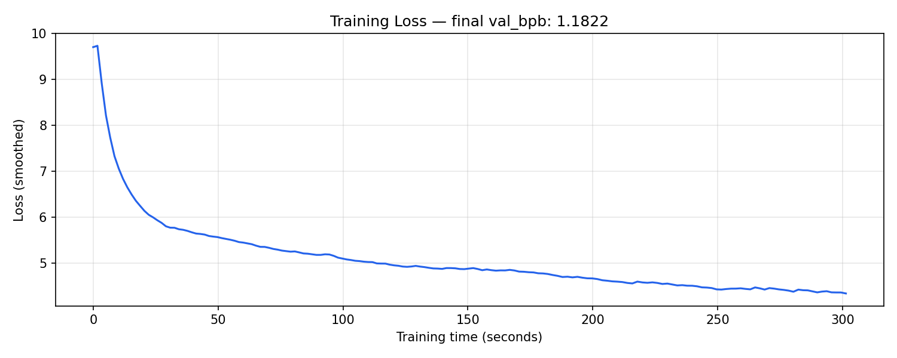

# hindi-llm-autoresearch

An autonomous LLM research loop for Hindi language modeling on Apple Silicon, built on MLX. The AI runs experiments, evaluates results, and iterates — all while you sleep.

**Based on the incredible work by:**
- [karpathy/autoresearch](https://github.com/karpathy/autoresearch)
- [trevin-creator/autoresearch-mlx](https://github.com/trevin-creator/autoresearch-mlx)

---

## What it does

Trains a small GPT-style language model on Hindi text ([ai4bharat/sangraha](https://huggingface.co/datasets/ai4bharat/sangraha)) using a fixed 5-minute wall-clock budget per experiment. The metric is **bits per byte (val_bpb)** — lower is better and comparable across vocab sizes.

The experiment loop is designed to be fully autonomous: make a change to `train.py`, run it, record the result, keep or discard, repeat. An AI agent can run this loop indefinitely while you're away.

---

## Requirements

- Apple Silicon Mac (M1/M2/M3/M4)
- Python 3.10–3.13
- [uv](https://github.com/astral-sh/uv)

---

## Setup

### 1. Install dependencies

```bash
uv sync
```

### 2. Download Hindi data

```bash
uv run download_hindi.py              # 4 shards (~1.4 GB, recommended)
uv run download_hindi.py --shards 6  # all 6 shards (~2.1 GB)
```

### 3. Adapt `prepare.py` for Hindi

The original `autoresearch` is built for a massive English dataset (`karpathy/climbmix-400b-shuffle`, ~6500 shards). To use Hindi data instead, only **3 constants** near the top of `prepare.py` need to change:

```python
# Original (English)         →  Hindi (4 shards downloaded)
MAX_SHARD  = 6542            →  MAX_SHARD  = 3   # shards 0–2 = train, 3 = val
VAL_SHARD  = MAX_SHARD       →  VAL_SHARD  = MAX_SHARD
VOCAB_SIZE = 8192            →  VOCAB_SIZE = 16384
```

**Why these changes:**
- `MAX_SHARD` / `VAL_SHARD` — set to match the shards you downloaded. The last shard is always pinned as validation; the rest are training.
- `VOCAB_SIZE` doubled to `16384` — Hindi (Devanagari) has a larger character set than English. A bigger BPE vocabulary gives the tokenizer enough room to learn meaningful Hindi subword units rather than falling back to individual characters.

Everything else in `prepare.py` — the BPE tokenizer training, best-fit document packing, and `evaluate_bpb` harness — is completely language-agnostic and works unchanged on Hindi text. The `download_hindi.py` script prints the exact values to paste after it finishes.

### 4. Train tokenizer and prepare cache

```bash
uv run prepare.py
```

Trains a BPE tokenizer on the Hindi shards and caches everything in `~/.cache/autoresearch/`. Only needs to run once.

### 4. Run training

```bash
uv run train.py
```

Training runs for exactly **5 minutes**, then evaluates and prints a summary:

```
---
val_bpb:          1.182203
training_seconds: 301.3
total_seconds:    317.3
peak_vram_mb:     8696.0
mfu_percent:      0.00
total_tokens_M:   10.9
num_steps:        166
num_params_M:     19.9
depth:            4
```



---

## Inspecting the model output

After training, the model is saved to `~/.cache/autoresearch/model.npz`. You can generate text from it:

```bash
# single prompt
uv run generate.py --prompt "भारत एक"

# interactive mode — type any Hindi prompt and hit Enter
uv run generate.py

# tune generation settings
uv run generate.py --prompt "एक बार की बात है" --tokens 200 --temp 0.8
```

The output will be **mostly gibberish** — the model only trained for 5 minutes on a fraction of the data. But it will produce valid Hindi-looking script with plausible word shapes and spacing, which already tells you it learned something real about the language structure. As `val_bpb` improves across experiments, the generations get noticeably more coherent.

---

## Model architecture

The model is a compact GPT with several modern touches:

- **RMSNorm** (without parameters) on residuals and QK vectors
- **RoPE** positional embeddings
- **Grouped Query Attention** (GQA)
- **Sliding window attention** with a configurable `SSSL` pattern (mix of short and long windows)
- **Value embeddings** on alternating layers — learned per-token value residuals gated per head
- **Learnable skip connections** (`resid_lambdas`, `x0_lambdas`) enabling a learned highway from input to each layer
- **Squared ReLU** MLP activation
- **Softcapped logits** (`15 * tanh(logits / 15)`)

All weights are in **bfloat16**. The optimizer is a custom **AdamW** with separate learning rates for embeddings, matrices, the unembedding head, and scalar parameters.

---

## Files

| File | Description |
|------|-------------|
| `train.py` | Model, optimizer, training loop — **the only file you modify in experiments** |
| `prepare.py` | Data download, BPE tokenizer training, dataloader, evaluation — **read-only** |
| `generate.py` | Load saved model and generate Hindi text from a prompt |
| `download_hindi.py` | One-time script to fetch Hindi parquet shards from HuggingFace |
| `pyproject.toml` | Dependencies (MLX, tiktoken, rustbpe, pyarrow, ...) |

---

## Key hyperparameters (in `train.py`)

| Parameter | Default | Description |
|-----------|---------|-------------|
| `DEPTH` | 4 | Number of transformer layers |
| `ASPECT_RATIO` | 64 | Controls model width relative to depth |
| `HEAD_DIM` | 128 | Attention head dimension |
| `WINDOW_PATTERN` | `"SSSL"` | Attention window pattern (S=short, L=long) |
| `TOTAL_BATCH_SIZE` | 2^16 | Tokens per gradient step |
| `MATRIX_LR` | 0.04 | Learning rate for weight matrices |
| `EMBEDDING_LR` | 0.6 | Learning rate for token embeddings |

---

## License

MIT
